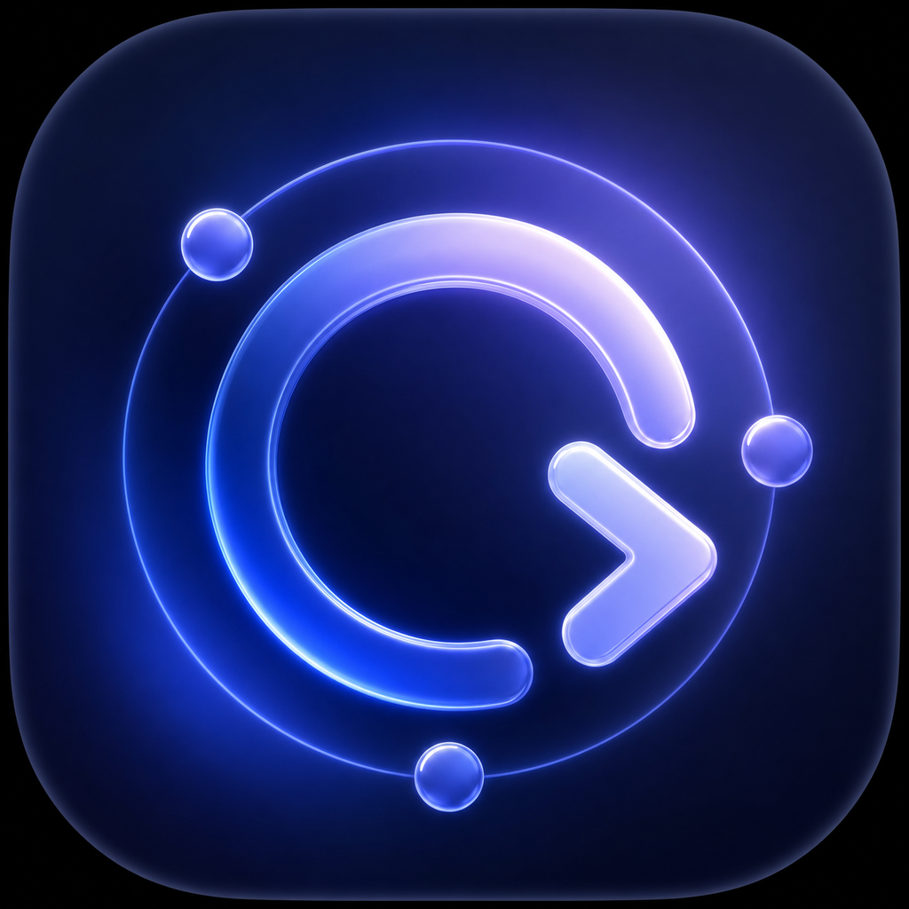

<p align="center">
  
</p>

<h1 align="center">Codex Limits for macOS</h1>

A native menu-bar app plus WidgetKit desktop widget that displays your current Codex rate-limit windows, remaining percentage, reset times, and every available limit-reset credit with its expiration.

The app talks only to the local `codex app-server` process. It reuses the Codex CLI's existing sign-in, stores only the latest limit snapshot in an App Group, and never reads or stores auth tokens itself.

## Requirements

- macOS 14 or newer
- Full Xcode 16 or newer
- Codex CLI installed and signed in (`codex login status`)
- An Apple Development signing team

## Open and run

1. Open `CodexLimits.xcodeproj` in Xcode.
2. Select the **CodexLimits** project, then choose your Development Team for both targets.
3. If `group.com.mertcetin.codexlimits` is unavailable to your team, replace it in:
   - both `.entitlements` files
   - `SnapshotStore.appGroupIdentifier`
4. Run the **CodexLimits** scheme.
5. Open Notification Center, choose **Edit Widgets**, search for **Codex Limits**, and add it to the desktop. The large layout shows all reset-credit expiration dates.

The app is menu-bar-only. Keep it running so it can refresh the shared widget snapshot; **Launch at Login** is available in Settings.

## Multiple accounts

Each ChatGPT/Codex account needs a separate `CODEX_HOME` directory. The default account continues to use your normal Codex CLI state. To prepare another account:

```sh
mkdir -p ~/.codex-work
CODEX_HOME=~/.codex-work codex login
```

Repeat with a different directory for each additional account. Then open **Codex Limits → Settings → Add Account Folder…** and select each directory. The app starts an isolated app-server process per profile and refreshes the accounts concurrently.

The menu-bar panel shows every configured account. Medium widgets show up to two accounts together, and the large widget shows up to three accounts with their usage windows and reset-credit expirations. When more accounts are available than a widget can display, it prioritizes the accounts with the highest remaining capacity, using each account's most constrained limit window as the deciding signal.

This tracks Codex subscription limits for ChatGPT/Codex identities. It does not aggregate OpenAI Platform API-key billing or organization budgets.

## How it works

For each configured profile, the host launches `codex app-server` over JSONL stdio with the corresponding `CODEX_HOME`, performs the required `initialize` / `initialized` handshake, and calls the stable `account/read` and `account/rateLimits/read` methods. Responses are converted to a compact local dashboard snapshot and shared with the sandboxed widget extension.

The app polls every five minutes by default. WidgetKit decides the final rendering schedule, so updates can be delayed by macOS.

## Regenerate the project

The checked-in Xcode project is generated from `project.yml` with [XcodeGen](https://github.com/yonaskolb/XcodeGen):

```sh
xcodegen generate
```

## Troubleshooting

- **Codex CLI not found:** Open Settings and enter the full path shown by `command -v codex`.
- **No limit data:** Confirm `codex login status` succeeds, then press **Refresh Now**.
- **Additional account is not signed in:** Run `CODEX_HOME=/absolute/path codex login status`, then `CODEX_HOME=/absolute/path codex login` if needed.
- **Widget says Waiting for Codex:** Run the menu-bar app once, ensure both targets use the same App Group, and refresh.
- **Signing error:** Ensure both targets have the same team and that the App Group capability exists for both bundle IDs.

Protocol reference: [Codex App Server](https://learn.chatgpt.com/docs/app-server)
